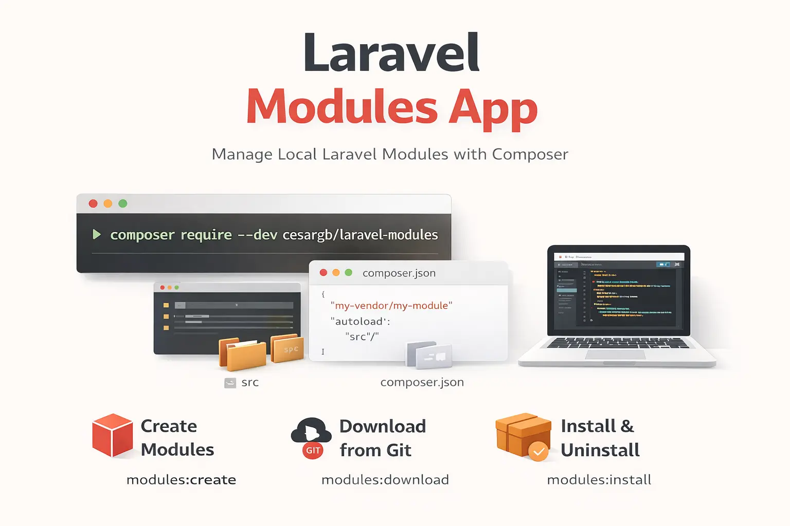

<p align="center">

</p>

[](https://github.com/cesargb/laravel-modules/actions/workflows/tests.yml)
[](https://github.com/cesargb/laravel-modules/actions/workflows/static-analysis.yml)
[](https://github.com/cesargb/laravel-modules/actions/workflows/lint.yml)

# Laravel Modules

A local module management system for Laravel using Composer. Organize your application into independent modules installed and uninstalled as Composer `path` packages.

## Installation

```bash
composer require --dev cesargb/laravel-modules
```

Then configure the modules directory:

```bash
php artisan modules:config
```

## Commands

### `modules:create`

Create a new local module:

```bash
php artisan modules:create my-vendor/my-module
```

### `modules:download`

Download a module from a Git repository:

```bash
php artisan modules:download https://github.com/vendor/module.git
php artisan modules:download https://github.com/vendor/module.git --branch=main
php artisan modules:download https://github.com/vendor/module.git --tag=v1.0.0
php artisan modules:download https://github.com/vendor/module.git --name=my-module
```

### `modules:list`

List all modules with their installation status:

```bash
php artisan modules:list
```

### `modules:install`

Install one or more modules:

```bash
php artisan modules:install my-module
php artisan modules:install module1 module2
```

### `modules:uninstall`

Uninstall one or more modules:

```bash
php artisan modules:uninstall my-module
php artisan modules:uninstall module1 module2
```

### `modules:remove`

Uninstall and permanently delete a module directory:

```bash
php artisan modules:remove my-module
php artisan modules:remove my-module --force
```

### `modules:test`

Run PHPUnit tests for all local modules:

```bash
php artisan modules:test
php artisan modules:test --testdox
php artisan modules:test --filter=UserTest
```

## Make Commands

Generate files inside a module using `module:make:*` commands:

```bash
php artisan module:make:model my-module Post
php artisan module:make:controller my-module PostController
php artisan module:make:request my-module StorePostRequest
php artisan module:make:resource my-module PostResource
php artisan module:make:event my-module PostCreated
php artisan module:make:listener my-module SendNotification
php artisan module:make:job my-module ProcessPayment
php artisan module:make:mail my-module WelcomeEmail
php artisan module:make:notification my-module InvoicePaid
php artisan module:make:policy my-module PostPolicy
php artisan module:make:rule my-module Uppercase
php artisan module:make:enum my-module UserStatus
php artisan module:make:cast my-module Json
php artisan module:make:command my-module SendEmailCommand
php artisan module:make:class my-module Services/PaymentService
php artisan module:make:trait my-module Concerns/HasUuid
php artisan module:make:interface my-module Contracts/PaymentGateway
php artisan module:make:provider my-module PaymentServiceProvider
php artisan module:make:test my-module UserTest
php artisan module:make:view my-module dashboard
php artisan module:make:component my-module Alert
php artisan module:make:exception my-module PaymentFailedException
php artisan module:make:scope my-module ActiveScope
php artisan module:make:channel my-module SmsChannel
php artisan module:make:middleware my-module CheckRole
php artisan module:make:observer my-module UserObserver
php artisan module:make:config my-module payment
```

## Programmatic Usage

```php
use Cesargb\Modules\Modules;

Modules::all();            // all modules
Modules::installed();      // installed modules
Modules::uninstalled();    // uninstalled modules
Modules::get('my-module'); // specific module
Modules::isInstalled('my-module');
Modules::install('my-module');
Modules::uninstall('my-module');
```

```php
$module = Modules::get('my-module');

$module->name;        // my-module
$module->packageName; // my-vendor/my-module
$module->version;     // ^1.0.0
$module->namespace;   // MyVendor\MyModule\
$module->installed;   // true/false

$module->install();
$module->uninstall();
```
